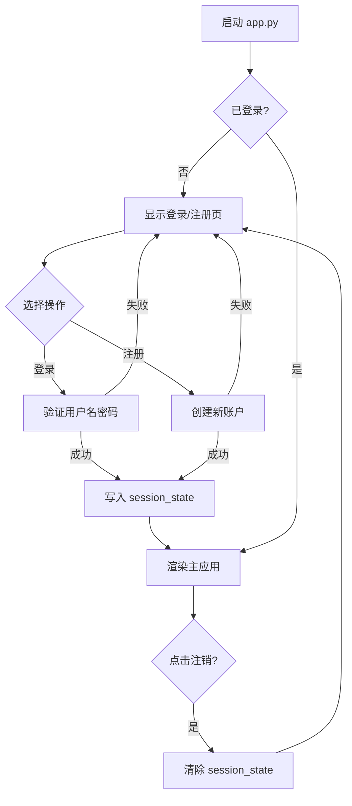

## 用户需求

为 HireInsight-Agent 添加标准多用户登录系统和对话历史持久化功能。

## 产品概述

在现有智能求职辅助系统基础上，增加用户账户体系，支持账号注册与登录，持久化保存面试模拟和灯塔计划的交互记录，并提供历史记录查看功能。同时将前端风格由 Apple 米色浅色主题调整为深色现代主题。

## 核心功能

- **用户注册与登录**：标准账号密码模式，密码使用 PBKDF2 哈希存储，支持注册、登录、注销
- **多用户数据隔离**：每个用户只能查看和管理自己的对话历史记录
- **面试模拟历史**：每次面试分析（简历输入、岗位、市场报告、差距诊断、面试题）自动保存，提供"历史对话"按钮查看过往记录
- **灯塔计划历史**：每次测评（岗位、年级、答题记录、技术倾向雷达图数据、路线图）自动保存，提供"历史记录"按钮查看过往结果
- **前端风格优化**：升级为深色现代主题，保持圆角卡片、舒适间距和文字框大小

## 技术栈选择

- **前端框架**：Streamlit（与现有项目一致）
- **数据库**：SQLite（与现有 `data/hireinsight.db` 共用同一数据库文件，新增三张表）
- **密码哈希**：`hashlib.pbkdf2_hmac`（Python 标准库，无需额外依赖）
- **前端样式**：纯 CSS（继承现有 Streamlit CSS 注入模式）

## 实现方案

### 总体策略

采用**模块化分层架构**：认证层（auth_db.py）→ 历史持久层（chat_history.py）→ 会话管理层（session_manager.py）→ 表示层（app.py），各层职责单一、高内聚低耦合。

### 数据库设计

在现有 `data/hireinsight.db` 中新增三张表，与 `job_positions` 表共存：

1. **`users` 表**：id（TEXT PK，UUID）、username（TEXT UNIQUE NOT NULL）、password_hash（TEXT NOT NULL）、display_name（TEXT）、created_at（TEXT NOT NULL）
2. **`interview_history` 表**：id（TEXT PK）、user_id（TEXT FK→users.id）、target_position、target_company、user_resume、market_report、gap_analysis、interview_questions（JSON TEXT）、created_at，索引 `idx_interview_user_id`
3. **`lighthouse_history` 表**：id（TEXT PK）、user_id（TEXT FK→users.id）、target_position、grade、user_answers（JSON TEXT）、tech_tendency（JSON TEXT）、roadmap（TEXT）、created_at，索引 `idx_lighthouse_user_id`

### 登录流程设计



### 历史记录保存时机

- **面试模拟**：在 `run_interview_workflow` 返回结果后，`app.py` 的 `render_interview()` 中调用 `chat_history.save_interview_record()` 保存
- **灯塔计划**：在 `assessment_node` 返回结果后，`app.py` 的 `render_lighthouse()` 中调用 `chat_history.save_lighthouse_record()` 保存

### 关键设计决策

- **密码方案选 PBKDF2 而非 bcrypt**：避免新增 C 扩展依赖，`hashlib.pbkdf2_hmac('sha256', ...)` 是 Python 标准库方案，Windows 零配置
- **历史记录使用 JSON TEXT 存储复杂字段**：`interview_questions`（List[str]）、`user_answers`（List[dict]）、`tech_tendency`（Dict）序列化为 JSON 字符串存储，避免额外建关联表
- **不修改 LangGraph 工作流代码**：历史保存逻辑在 `app.py` 层面完成，graph 节点保持纯计算职责不变

## 实现注意事项

### 性能

- 历史查询使用 `user_id` 索引，单用户历史记录数量有限（通常 < 1000 条），SQLite 足以胜任
- 密码哈希使用 100000 次迭代（PBKDF2 标准推荐值），注册/登录耗时 < 100ms

### 安全

- 密码永不明文存储，仅存 PBKDF2 哈希值
- 所有 SQL 使用参数化查询，防注入
- `session_state` 中仅存 `user_id` 和 `username`，不存密码

### 兼容性

- 现有 `data/hireinsight.db` 中的 `job_positions` 表不受影响
- 新增表使用 `CREATE TABLE IF NOT EXISTS`，幂等安全
- 现有页面路由和功能逻辑不变

## 目录结构

```
HireInsight_Agent/
├── app.py                          # [MODIFY] 主入口：新增登录页渲染、登录保护、历史记录查看UI、深色主题CSS、页面路由调整
├── utils/
│   ├── auth_db.py                  # [NEW] 用户认证数据库层：建表、注册（PBKDF2哈希）、登录验证、用户查询
│   ├── chat_history.py             # [NEW] 对话历史数据库层：建表、面试记录增删查、灯塔记录增删查、按用户ID筛选
│   └── session_manager.py          # [NEW] 会话管理器：登录态检查、用户信息存取、注销清理、初始化认证表
├── data/
│   └── hireinsight.db              # [AUTO] 数据库自动追加 users/interview_history/lighthouse_history 三张表
├── requirements.txt                # [MODIFY] 无需新增依赖（全部使用标准库）
└── docs/
    └── plan/
        └── 用户登录与历史模块开发计划.md  # [NEW] 完整开发计划文档
```

## 关键代码结构

### auth_db.py 接口设计

```python
def init_auth_tables(db_path: str) -> None:
    """幂等建表：users 表（若不存在则创建）"""

def register_user(username: str, password: str, display_name: str, db_path: str) -> tuple[bool, str]:
    """注册用户，返回 (是否成功, 错误信息)"""

def verify_login(username: str, password: str, db_path: str) -> dict | None:
    """验证登录，成功返回用户信息字典，失败返回 None"""

def hash_password(password: str, salt: bytes | None = None) -> tuple[str, bytes]:
    """PBKDF2-SHA256 哈希密码，返回 (hex_hash, salt)"""
```

### chat_history.py 接口设计

```python
def init_history_tables(db_path: str) -> None:
    """幂等建表：interview_history + lighthouse_history 表"""

def save_interview_record(user_id: str, target_position: str, target_company: str | None,
                          user_resume: str, market_report: str, gap_analysis: str,
                          interview_questions: list[str], db_path: str) -> str:
    """保存面试记录，返回记录 ID"""

def save_lighthouse_record(user_id: str, target_position: str, grade: str,
                           user_answers: list[dict], tech_tendency: dict | None,
                           roadmap: str | None, db_path: str) -> str:
    """保存灯塔记录，返回记录 ID"""

def get_interview_history(user_id: str, db_path: str, limit: int = 20) -> list[dict]:
    """获取用户的面试历史列表（按时间倒序）"""

def get_lighthouse_history(user_id: str, db_path: str, limit: int = 20) -> list[dict]:
    """获取用户的灯塔历史列表（按时间倒序）"""

def delete_interview_record(record_id: str, user_id: str, db_path: str) -> bool:
    """删除指定面试记录（仅限本人）"""

def delete_lighthouse_record(record_id: str, user_id: str, db_path: str) -> bool:
    """删除指定灯塔记录（仅限本人）"""
```

## 设计风格

采用深色现代主题替代现有 Apple 米色风格。整体使用深灰/炭黑底色配合柔和白色文字，圆角卡片、舒适间距、适当留白，营造专业沉稳的视觉感受。

### 页面规划

#### 登录/注册页

- **顶部 Logo 区**：居中显示 "HireInsight" 品牌名，下方副标题
- **表单卡片区**：居中白色圆角卡片（在深色背景上形成对比），包含用户名输入框、密码输入框、显示名输入框（仅注册模式）、登录/注册切换标签、主操作按钮
- **底部信息区**：版权信息和版本号

#### 面试模拟页

- **现有流程保持不变**：简历上传 → 岗位输入 → 开始分析 → 结果展示
- **新增历史记录入口**：在页面顶部标题右侧新增"历史对话"按钮，点击后在侧边或弹窗形式展示历史记录列表
- **历史列表**：每条记录显示目标岗位、公司、时间，点击展开查看完整报告

#### 灯塔计划页

- **现有流程保持不变**：岗位输入 → 测评答题 → 雷达图 + 路线图
- **新增历史记录入口**：标题栏右侧"历史记录"按钮
- **历史列表**：显示目标岗位、年级、时间，点击展开查看历史雷达图和路线图

## Agent Extensions

### SubAgent

- **code-explorer**
- 用途：在实现过程中跨多文件搜索现有登录/会话相关代码，确认无冲突
- 预期结果：确保新增代码不与现有 session_state 键名或页面路由逻辑冲突