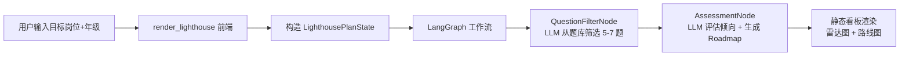

模块一灯塔计划开发计划
为 HireInsight-Agent 开发模块一「灯塔计划」，实现低年级学生职业规划情景测评：预设题库 + LLM 动态调题 → 用户答题 → LangGraph 工作流评估技术倾向 → 输出 JSON + Markdown 技术演进 Roadmap。
## 用户需求

实现模块一「灯塔计划」职业规划模块，为低年级学生提供技术倾向测评和个性化学习路线图。

## 产品概述

灯塔计划通过情景多选题测评用户的技术偏好，调用 DeepSeek AI 分析答题结果，输出六维度技术倾向雷达数据和结构化学习路线图（JSON + Markdown 双格式），帮助求职者明确技术发展方向。

## 核心功能

- **情景多选题测评**：预设 10 道涵盖前端、后端、AI/数据、测试运维、产品、客户端六大方向的情景选择题，LLM 根据目标岗位和年级从题库中动态筛选 5-7 道最相关的题目展示给用户
- **AI 技术倾向评估**：将用户答题结果与目标岗位上下文发送给 DeepSeek，LLM 输出六维度技术倾向分值（前端/后端/AI数据/测试运维/产品/客户端）及综合评语
- **个性化 Roadmap 生成**：基于技术倾向评估结果，LLM 生成结构化 JSON（含阶段划分、里程碑、推荐资源）和 Markdown 可读版路线图
- **静态看板渲染**：执行完成后一次性渲染技术倾向雷达图 + 路线图看板，与模块三保持一致

## 技术栈

- **前端交互**：Streamlit 1.39.0 同步阻塞模式，`st.status` 容器 + `st.radio` 单选题组件
- **AI 编排**：LangGraph 0.2.56 直线 DAG（两节点串联，无循环、无条件边）
- **LLM**：DeepSeek API (`deepseek-reasoner`)，复用 `graphs/nodes.py` 已有的 `get_llm_client()` / `call_deepseek()`（`ChatOpenAI(timeout=120, max_retries=0)`）
- **数据处理**：Pandas + 内置 `json` 模块（Roadmap JSON 解析）
- **图表**：Plotly（技术倾向雷达图）

## 实现方案

### 高层策略

采用与模块三完全一致的架构范式：LangGraph 图编排 → `st.status` 锁前端 → 静态 Markdown 看板。灯塔计划逻辑比模块三更简单（两节点串联：`QuestionFilterNode → AssessmentNode`），但严格遵循相同的 StateGraph 构建、异常降级、进度上报模式，确保代码风格统一和 AI Vibe Coding 友好性。

### LangGraph 图拓扑设计



### 关键技术决策

#### 1. 两节点设计（而非三节点）

模块三需要三个独立 Agent（市场→诊断→出题），但灯塔计划的选题和评估可在同一个 LLM 调用中完成评估和 Roadmap 生成，拆为两个节点即可覆盖全部逻辑：选题节点负责动态过滤、评估节点负责倾向分析+路线图生成。减少一次 API 调用即减少约 15-30 秒等待时间和费用。

#### 2. 题目库瘦回归 utils/ 目录

题目库本质是静态数据资源，放置 `utils/question_bank.py`（而非 `graphs/` 下）符合本项目数据/逻辑分离的既有惯例（`utils/rag_loader.py` 存向量库、`utils/data_stats.py` 存统计逻辑）。

#### 3. 两阶段前端交互（含 st.session_state 缓存防护）

**阶段一**：用户填写目标岗位+年级 → 点击"🚀 开始测评" → `st.session_state` 检查 `filtered_questions` 是否存在：
- **不存在**：调用 LangGraph QuestionFilterNode（仅此一次），结果写入 `st.session_state.filtered_questions`，渲染 5-7 道单选题
- **已存在**：直接读取缓存渲染题目，零 API 调用

用户答题时，`st.radio` 的 `on_change` 回调将选择写入 `st.session_state.user_answers`（dict 结构，键为 question_id）。所有 re-run 都从 session_state 读状态，**绝不会重新调用 LLM**。

**阶段二**：用户点击"📊 生成我的技术路线图" → 清理 `st.session_state.filtered_questions`（释放缓存）→ `st.status` 包裹 LangGraph AssessmentNode → 渲染结果看板

不使用"先全部展示再一次性提交"的单阶段模式，因为需要 LLM 先动态筛选题目。两阶段清晰分离，配合 session_state 缓存，同时满足 Streamlit 的 re-run 特性和 API 调用次数控制。

#### 4. 预设题库的设计维度（硬核工程痛点导向）

10 道情景题覆盖六大技术方向，每道题 4 个选项分别倾向不同方向。设计原则：**贴近真实技术挣扎，避免空泛行业黑话**。

**设计哲学**：低年级学生面临的核心困惑不是"哪个方向有前途"，而是"我到底喜欢解决什么问题"。因此每道题的选项必须呈现**同一问题的三种不同求解路径**，让选择直接映射到技术倾向：

- **前端倾向**：关注交互体验、组件抽象、状态管理、渲染性能
- **后端倾向**：关注业务逻辑、并发框架、数据库优化、系统吞吐
- **AI/数据倾向**：关注模型训练、数据分析、数学抽象、特征工程
- **测试运维倾向**：关注 CI/CD、自动化测试、容器编排、系统可靠性
- **产品倾向**：关注用户需求、商业价值、功能设计、数据驱动决策
- **客户端倾向**：关注 OS 层性能、内存管理、渲染管线、硬件适配

**题库示例重构**：

```
旧设计（空泛）：
"你参与了一个项目，需要在 2 周内从零实现一个数据可视化仪表盘..."
选项：React/ECharts | RESTful API | Pandas | CI/CD

新设计（硬核痛点）：
"面对一个高并发场景下的系统瓶颈——单机 QPS 上不去且 RT 持续恶化，
你更愿意投身哪个方向来根治这个问题？"
选项A：梳理 Java 后端的线程池调度与数据库连接池配置，深挖 Spring Boot
        的异步模型与事务传播机制（后端）
选项B：死磕 OS 层面的 epoll 事件循环与内存页调度，用 C 绕过 JVM 直接
        改写网络 I/O 的临界路径（客户端/底层）
选项C：运用离散数学中的哈斯图对请求依赖关系进行偏序建模，从群论视角
        重新设计分布式锁的共识算法（AI/数据）
选项D：建立全链路压测体系与自动化故障注入平台，通过可观测性数据定位
        瓶颈的系统性成因（测试运维）
```

**每道题的设计要求**：
1. 题干必须是真实的技术挑战场景（如性能优化、架构选型、Bug 排查、技术债治理）
2. 4 个选项分别指向不同技术方向，且每个选项都必须是**可行且合理的解决方案**（迷魂选项），不能有明显的对错之分
3. 选项措辞要包含具体的技术关键词（如 "epoll""哈斯图""线程池""CI/CD Pipeline"），以评估用户对领域术语的自然偏好
4. 适当引入跨学科概念（数学抽象、系统工程思维），区分"工具型开发者"和"思想型开发者"

10 道题覆盖广度：性能优化（2 题）、架构选型（2 题）、Bug 排查（1 题）、技术债治理（1 题）、数据处理（2 题）、项目规划（1 题）、安全攻防（1 题）

### ⚠️ 风险防控（Critical — 三个必须防范的技术陷阱）

#### 陷阱一：st.radio 重运行导致 LLM 重复调用

**问题根源**：Streamlit 的底层机制是——用户每点击一次 `st.radio` 切换选项，整个 `app.py` 脚本就会从上到下重新运行一次。如果 `filtered_questions` 不缓存，用户每答一题就会重新触发一次 `QuestionFilterNode`（LLM API 调用），清空当前答题状态 + API 费用失控。

**强制防范措施**（必须严格执行）：
1. `QuestionFilterNode` 执行完毕后，**立即**将 `filtered_questions` 写入 `st.session_state.filtered_questions`（在 `app.py` 的 `render_lighthouse()` 中，而非节点内部）
2. 在 `render_lighthouse()` 的阶段一渲染逻辑中，**优先检查** `st.session_state` 是否已有 `filtered_questions`：
   ```python
   if "filtered_questions" not in st.session_state:
       # 首次执行：调 LLM → 写 session_state
       st.session_state.filtered_questions = run_filter_node(...)
   # 后续 re-run：直接读缓存，跳过 LLM 调用
   questions = st.session_state.filtered_questions
   ```
3. 同样，`user_answers` 也必须以 `st.session_state` 为唯一数据源，使用 `st.session_state.setdefault("user_answers", {})` 初始化，每次 radio `on_change` 回调更新 session_state（而非依赖脚本顶部变量）
4. 阶段二提交完成后，必须清理 `st.session_state` 中与本次测评相关的键，避免下次测评残留

#### 陷阱二：DeepSeek Reasoner 的思考链（CoT）污染 JSON 输出

**问题根源**：`deepseek-reasoner` 具备深度思考能力，在输出最终结果前**大概率会先输出大段的思考链（CoT）文本**，格式类似：
```
嗯，用户选择了后端倾向较高的选项，让我分析一下...
（大段推理过程）
根据以上分析，技术倾向结果如下：
```json
{"frontend": 30, "backend": 85, ...}
```
```

如果直接用 `json.loads(response_text)` 解析，必然失败。更危险的是，普通正则 `r'\{.*\}'` 可能匹配到思考链中的 JSON 片段，而非最终结果。

**强制防范措施**（必须严格执行）：
1. **精准提取 ` ```json ` 代码块**：使用正则 `r'```json\s*(\{.*?\})\s*```'`（re.DOTALL）优先匹配 fenced code block
2. **回退策略（多层 Fallback）**：
   - 第 1 层：正则提取 ` ```json ... ``` ` 块 → `json.loads()`
   - 第 2 层：正则提取最后一个完整 JSON 对象 `r'(\{[^{}]*(?:\{[^{}]*\}[^{}]*)*\})'`（注意：思考链中可能有多个 JSON，取**最后一个**才是最终结果）
   - 第 3 层：所有 JSON 解析失败 → **不回退到 LLM 重试**（避免雪崩），而是将原始响应写入 `roadmap` 纯文本字段，设置 `execution_error = "JSON 解析失败，已降级为纯文本路线图"`，流程继续到 END 节点
3. **在 `AssessmentNode` 内部实现上述逻辑**，封装为独立函数 `extract_json_from_reasoner_response(text: str) -> Optional[Dict]`
4. **日志记录**：每次解析失败时记录原始响应前 500 字符到日志，便于排查

#### 陷阱三：超时逃生通道的闭环

**问题根源**：单节点 `timeout=120` 只能阻止 LLM 永久挂起，但如果超时发生后没有正确的图流转逻辑（`execution_error` → END 节点），前端会白屏崩溃或无限等待。

**强制防范措施**（必须严格执行）：
1. 在每个节点函数内部使用 `try-except` 包裹 LLM 调用：
   ```python
   try:
       response = llm.invoke(prompt)
   except Exception as e:
       return {
           "execution_error": f"节点名称 超时或异常: {str(e)}",
           "is_completed": True  # 标记完成以触发降级渲染
       }
   ```
2. `is_completed = True` + `execution_error` 非空 → 前端跳过正常结果渲染，改为展示降级页面（友好的错误提示 + "建议重试"按钮）
3. **禁止**在超时后自动重试（`max_retries=0` 已在 `get_llm_client()` 中设定，不得修改）
4. 图拓扑中不需要额外的条件边（保持直线 DAG），降级逻辑完全在节点返回的 State 和前端渲染判断中实现

### 常规实现注意事项

- **性能**：选题节点调用一次 DeepSeek API（约 10-20s），评估节点调用一次（约 15-30s），总计约 25-50s。`timeout=120` 保证不会永久阻塞。加上 `st.session_state` 缓存后，用户答题期间的 re-run 零 API 调用。
- **进度上报**：每个节点内通过 `st.write()` 向 `st.status` 容器上报当前阶段，与模块三完全一致。
- **状态持久化**：`LighthousePlanState` 所有字段支持序列化，适配 Streamlit `st.session_state` 和 LangGraph 检查点。
- **爆破半径控制**：仅修改 `graphs/state.py`（扩展字段）、`graphs/__init__.py`（新增导出）、`app.py`（重写 `render_lighthouse()`），新建 3 个文件。不影响模块二和模块三。
- **日志**：复用 Python `logging` 模块，不在 Streamlit 生产环境输出过多调试信息。但 JSON 解析失败时需记录关键排查信息。
- **向后兼容**：新增 State 字段使用 `total=False`（TypedDict 可选），不影响已存在的 `LighthousePlanState` 使用方。

## 架构设计

### 系统架构

与模块三完全一致的三层架构：

1. **数据层**：`utils/question_bank.py` 提供预设题库，`graphs/state.py` 定义 State Schema
2. **编排层**：`graphs/lighthouse_nodes.py` 实现 Agent 节点，`graphs/lighthouse_graph.py` 构建 LangGraph 图
3. **展示层**：`app.py render_lighthouse()` 驱动两阶段 UI 和静态看板渲染

### 数据流

```
用户输入(target_position, grade) → 点击"开始测评"
  → st.session_state 检查 filtered_questions 缓存
    ├─ 未缓存：构造 LighthousePlanState → [QuestionFilterNode] LLM 筛选 5-7 题
    │           → 结果写入 st.session_state.filtered_questions（仅此一次）
    └─ 已缓存：跳过 LLM 调用，直接读缓存
  → 前端渲染题目（st.radio × N）
  → 每道题选择 → on_change 写入 st.session_state.user_answers → 页面 re-run
     （re-run 时：命中 filtered_questions 缓存 + 读 user_answers → 零 API 调用）
  → 用户点击"生成路线图"
  → 清理 st.session_state.filtered_questions 缓存
  → [AssessmentNode] LLM 评估倾向 + 生成 Roadmap JSON
    ├─ 正常：tech_tendency + roadmap_json + roadmap（Markdown）
    └─ 超时/异常：execution_error 非空 → 前端降级渲染错误提示
  → 前端渲染：Plotly 雷达图 + Markdown 路线图（或降级错误页）
```

## 目录结构

```
HireInsight-Agent/
├── graphs/
│   ├── state.py                    # [MODIFY] 扩展 LighthousePlanState，新增 target_position、grade、questions、user_answers、roadmap_json、execution_error 字段
│   ├── __init__.py                 # [MODIFY] 新增导出 run_lighthouse_workflow
│   ├── lighthouse_nodes.py         # [NEW] 灯塔计划 Agent 节点实现。包含 question_filter_node（LLM 从题库筛选题目）和 assessment_node（技术倾向评估 + Roadmap 生成）两个节点函数，复用 graphs/nodes.py 的 get_llm_client()/call_deepseek()
│   └── lighthouse_graph.py         # [NEW] 灯塔计划 LangGraph 图构建与编译。包含 create_lighthouse_graph()、compile_lighthouse_graph()、run_lighthouse_workflow()、run_lighthouse_workflow_fallback()，与 interview_graph.py 架构完全一致
├── utils/
│   └── question_bank.py            # [NEW] 预设情景多选题库。定义 QUESTION_BANK: List[dict] 共 10 题，每题含 id、scenario（题干）、options（4 个选项，每个含 text 和 tendency 倾向标签）、难度等级。提供 get_full_question_bank() 和 format_questions_for_llm() 函数
├── app.py                          # [MODIFY] 重写 render_lighthouse() 函数。实现两阶段 UI：阶段一（输入岗位+年级 → LLM 选题 → st.radio 渲染题目）、阶段二（答题提交 → st.status 包裹 LangGraph 执行 → Plotly 雷达图 + Markdown 路线图静态看板）
└── tests/
    └── test_lighthouse_graph.py    # [NEW] 模块一单元测试。覆盖 question_filter_node、assessment_node、端到端工作流执行、JSON 解析鲁棒性
```

## 关键代码结构

### 扩展后的 LighthousePlanState

```python
class LighthousePlanState(TypedDict, total=False):
    # === 用户输入 ===
    target_position: str                    # 目标岗位（如"Java后端开发""AI算法工程师"）
    grade: str                              # 当前年级（如"大三"、"研一"）

    # === 题目数据 ===
    all_questions: List[dict]               # 完整题库（10 题）
    filtered_questions: List[dict]          # LLM 筛选后的题目（5-7 题）

    # === 用户答题 ===
    user_answers: List[dict]                # 答题详情 [{question_id, selected_option, tendency}]
    user_choices: List[int]                  # 保留兼容：各题所选选项索引

    # === Agent 输出 ===
    tech_tendency: Optional[Dict[str, float]]   # 六维度技术倾向分值（0-100）
    roadmap_json: Optional[Dict[str, Any]]      # JSON 结构化路线图
    roadmap: Optional[str]                      # Markdown 可读路线图

    # === 执行状态 ===
    current_step: str                       # 当前执行阶段
    execution_error: Optional[str]          # 执行错误信息（非空时前端渲染降级页面而非正常结果）
    is_completed: bool                      # 是否完成（含异常完成：is_completed=True + execution_error 非空）
```

**关键约定**：
- `execution_error` 非空 + `is_completed = True` → 前端渲染降级错误页（友好的错误提示 + "建议重试"按钮），而非白屏崩溃
- JSON 解析失败不算 `execution_error`（会尝试降级为纯文本 `roadmap`），只有 LLM 调用超时/网络异常才算

### 题目库条目结构

```python
# utils/question_bank.py 中的单题结构（硬核工程痛点版）
{
    "id": 1,
    "scenario": "面对一个高并发场景下的系统瓶颈——单机 QPS 上不去且 RT 持续恶化，"
                "你更愿意投身哪个方向来根治这个问题？",
    "options": [
        {"text": "梳理 Java 后端的线程池调度与数据库连接池配置，"
                  "深挖 Spring Boot 的异步模型与事务传播机制", "tendency": "后端"},
        {"text": "死磕 OS 层面的 epoll 事件循环与内存页调度，"
                  "用 C 绕过 JVM 直接改写网络 I/O 的临界路径", "tendency": "客户端"},
        {"text": "运用离散数学中的哈斯图对请求依赖关系进行偏序建模，"
                  "从群论视角重新设计分布式锁的共识算法", "tendency": "AI数据"},
        {"text": "建立全链路压测体系与自动化故障注入平台，"
                  "通过可观测性数据定位瓶颈的系统性成因", "tendency": "测试运维"},
    ],
    "difficulty": "medium",
    "category": "性能优化",
    "tags": ["并发", "OS", "数学建模", "可观测性"]
}
```

**关键设计规则**：
1. 每道题的 4 个选项必须覆盖 4 个不同技术方向（不重复），且都是合理可行的方案
2. `tendency` 取值限制为六大方向之一：`前端`、`后端`、`AI数据`、`测试运维`、`产品`、`客户端`
3. 选项长度建议 20-40 字，必须包含至少一个该领域的**具体技术术语**
4. `tags` 标签用于 LLM 选题时按岗位匹配度筛选

## 设计风格

继承现有 Streamlit 原生日间风格，与模块二的暗色数据大屏和模块三的简洁专业风格共同保持统一视觉语言。灯塔计划聚焦"低年级学生职业规划"场景，主色调采用温暖引导的蓝色系，减少数据大屏的暗色调压迫感，增加亲和力。

## 界面布局（两阶段设计）

### 阶段一：信息输入 + 答题

- **顶部横幅**：蓝色渐变背景区，标题"🧭 灯塔计划"，副标题"为你的技术生涯点亮第一座灯塔"
- **输入卡片**：白色圆角卡片承载目标岗位输入框 + 年级下拉选择器，按钮"🚀 开始测评"
- **题目渲染区**：`st.status` 容器内等待 LLM 选题，完成后以卡片式单选题渲染 5-7 道情景题，每题使用 `st.radio` 组件，选项前标注 ABCD
- **提交区**：所有题目回答完毕后，底部蓝色主按钮"📊 生成我的技术路线图"

### 阶段二：结果看板

- **技术倾向雷达图**：Plotly 雷达图展示六维度技术倾向分值（0-100），蓝色填充半透明区域
- **综合评语**：雷达图下方的 Markdown 引言块，用 `>` Blockquote 展示 AI 生成的综合评价
- **Roadmap 路线图**：结构化 Markdown 呈现，分阶段（入门→进阶→实战→专精），每个阶段含推荐资源、预计时间、里程碑
- **学习资源卡片**：三列布局展示推荐课程/书籍/项目

## 交互细节

- 阶段一题目未全部回答时"提交"按钮禁用（disabled），防止空提交
- LLM 执行期间 `st.status` 展示步骤进度（"正在分析最适合你的题目..." → "正在评估技术倾向..."）
- 雷达图支持 hover 显示具体分值

## Agent Extensions

### SubAgent

- **code-explorer**
- Purpose: 探索 `graphs/` 目录下的现有代码结构，确认 `get_llm_client()` / `call_deepseek()` 的确切函数签名和导入路径，以及 `interview_graph.py` 的完整 fallback 模式，确保 lighthouse 实现与模块三架构完全一致
- Expected outcome: 获取精确的函数签名、导入路径、图构建模板，产出一份可直接复用的架构参考清单