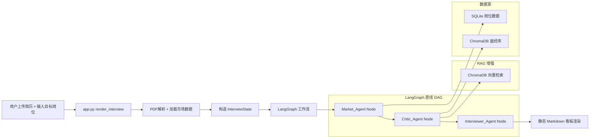

# 模块三：LangGraph 拓扑工作流 + 本地 RAG 开发计划

## 产品概述
模块三是 HireInsight-Agent 系统的核心亮点模块，通过 LangGraph 拓扑工作流串联三个 AI Agent（Market_Agent → Critic_Agent → Interviewer_Agent），结合本地 ChromaDB 向量检索（RAG），为求职者提供从市场分析、简历诊断到面试题生成的完整 AI 面试模拟体验。

## 核心功能
- **市场趋势分析（Market_Agent）**：基于 SQLite 岗位数据，调用 DeepSeek API 生成目标岗位的市场竞争分析报告
- **简历差距诊断（Critic_Agent）**：上传 PDF 简历后，AI 对比简历与市场 JD，结合 RAG 检索的企业面经，输出技能差距诊断报告
- **定制面试题生成（Interviewer_Agent）**：基于差距诊断结果，动态生成 3-5 道定制化面试变形题
- **PDF 简历解析**：支持上传 PDF 格式简历，自动提取文本内容
- **ChromaDB 本地 RAG**：嵌入式向量库检索 Top-2 企业面经片段，增强诊断准确度
- **静态 Markdown 看板输出**：执行完成后一次性渲染所有 Agent 输出，避免 Streamlit 重运行导致状态丢失

## 当前进度与边界
- `graphs/state.py`：State 定义完整，字段设计合理 ✅
- `graphs/nodes.py`：三个 Agent 节点函数存在，但所有 LLM 调用均为占位符输出（TODO 未实现）⚠️
- `graphs/interview_graph.py`：直线 DAG 构建正确，`run_interview_workflow()` 存在但 `signal` 超时在 Windows 不工作 ⚠️
- `utils/rag_loader.py`：ChromaDB 初始化、Mock 数据、查询函数均已完成 ✅
- `utils/pdf_parser.py`：`extract_text_from_pdf_bytes()` 已完成 ✅
- `utils/data_stats.py`：已有 `generate_agent_prompt_summary()` 函数 ✅
- `app.py` `render_interview()`：前端 UI 骨架存在，但未接入任何 LangGraph 函数 ⚠️

## 技术栈选择
- **前端框架**：Streamlit 1.39.0（沿用现有项目）
- **AI 编排**：LangGraph 0.2.56 + LangChain Core 0.3.86
- **LLM**：DeepSeek API（`deepseek-reasoner` 模型，具备 Reasoning 思考链能力；通过 `ChatOpenAI` 兼容接口调用，环境变量注入 API Key）
- **向量检索**：ChromaDB 0.5.5（嵌入式 PersistentClient 模式）
- **PDF 解析**：pdfplumber 0.11.4
- **数据处理**：Pandas 2.2.3 + SQLite3（内置）

## 实现方案

### 高层策略
采用纯同步直线 DAG 执行模式：三个 Agent 节点串联执行，无循环、无条件边。`st.status` 容器在 LangGraph 执行期间锁死前端，防止用户误触导致中断。执行完成后一次性渲染静态 Markdown 看板。

### 关键技术方案

#### 1. `graphs/nodes.py` — 接入 DeepSeek LLM + 节点内进度上报
- **`get_llm_client()` 实现**：
  - 使用 `ChatOpenAI` 兼容接口调用 DeepSeek API（而非 `ChatDeepSeek`，避免 LangChain 老版本内置类不支持新模型参数）
  - 实例化时**必须显式传入 `timeout=120`**（2 分钟），确保 API 超时时 LangChain 抛出 `Timeout` 异常，外层 `try...except` 才能捕获并触发 fallback 降级通道
  - 模块级全局变量缓存 LLM 客户端实例（避免每次节点调用重复初始化）
  - 示例：
    ```python
    from langchain_openai import ChatOpenAI
    _LLM_CLIENT = None
    
    def get_llm_client():
        global _LLM_CLIENT
        if _LLM_CLIENT is None:
            _LLM_CLIENT = ChatOpenAI(
                model="deepseek-reasoner",
                openai_api_base="https://api.deepseek.com/v1",
                openai_api_key=os.getenv("DEEPSEEK_API_KEY"),
                timeout=120,       # 锁定 2 分钟超时逃生通道
                max_retries=0,     # 不做自动重试，让异常快速冒泡
            )
        return _LLM_CLIENT
    ```
- **节点内进度上报（`st.status` 跨节点驱动方案）**：
  - **核心原则**：不在 `app.py` 里手动 `status.update()`，因为 LangGraph 在图内执行时 `app.py` 处于阻塞态，无法感知当前节点。
  - **正确做法**：在每个节点函数内部直接调用 `st.write()`。Streamlit 会自动将 `st.write()` 的输出追加到当前激活的 `st.status` 容器内部，前端会优雅地展示逐行展开的步骤日志。
  - 示例：
    ```python
    def market_agent_node(state: InterviewState) -> dict:
        st.write("🔄 **[1/3] Market_Agent** 正在分析市场趋势与竞争格局...")
        # ... LLM 调用逻辑 ...
        st.write("✅ **[1/3] Market_Agent** 分析完成")
        return {"market_report": report, "current_step": "critic"}
    ```
- **`market_agent_node()` 实现**：
  - 调用 `utils.data_stats.generate_agent_prompt_summary()` 获取市场数据 Markdown 摘要
  - 构造 `SystemMessage`（定义市场分析师角色）+ `HumanMessage`（传入摘要 + target_position）
  - 调用 `llm.invoke([system_msg, human_msg])` 获取真实报告
  - 输出格式：结构化 Markdown（`## 市场趋势与竞争分析报告` 开头）
- **`critic_agent_node()` 实现**：
  - 调用 `utils.rag_loader.query_experiences(query=target_position, n_results=2)` 检索面经片段
  - 将 `user_resume`、`market_report`、`rag_context` 拼接后喂给 LLM
  - 输出格式：Markdown 表格（维度 | 当前水平 | 市场要求 | 差距）
- **`interviewer_agent_node()` 实现**：
  - 基于 `gap_analysis` 构造 Prompt，要求 LLM 生成 3-5 道定制面试题
  - 输出：`interview_questions`（List[str]）+ 格式化 Markdown 输出到 `market_report` 字段

#### 2. `graphs/interview_graph.py` — Windows 超时兼容 + 硬超时逃生通道
- **问题 1**：`import signal` + `signal.SIGALRM` 在 Windows 上不支持，必须移除
- **问题 2**：仅移除 `signal` 而**不在 LLM 客户端层面设置超时**，则网络卡死时 `llm.invoke()` 会永久阻塞，前端无限转圈，"2 分钟逃生通道"形同虚设
- **修正方案**：
  - 移除 `signal` 相关所有代码
  - **超时锁死在 LLM 客户端初始化层**：`get_llm_client()` 中 `ChatOpenAI(timeout=120)`，一旦 API 响应超过 2 分钟，LangChain 自动抛出 `requests.exceptions.Timeout` 异常
  - `run_interview_workflow()` 的 `try...except` 能捕获该异常，触发 fallback 降级通道
- **降级方案**：保留 `run_interview_workflow_fallback()` 降级函数，捕获超时/网络异常后顺序链式执行

#### 3. `app.py` `render_interview()` — 前端完整接入
- **简历解析流程**：
  ```python
  if uploaded_file is not None:
      pdf_bytes = uploaded_file.read()
      user_resume = extract_text_from_pdf_bytes(pdf_bytes)
  ```
- **市场数据加载**：
  ```python
  from utils.data_persistence import load_from_sqlite
  df = load_from_sqlite(_DB_PATH)
  ```
- **`st.status` 集成（修正方案）**：
  ```python
  with st.status("🤖 AI 面试官正在工作...", expanded=True) as status:
      result = run_interview_workflow(initial_state)
      status.update(label="✅ 分析完成", state="complete")
  ```
  - **关键**：`app.py` 只负责打开和关闭 `st.status` 容器，**不在外部手动 `status.update()` 中间标签**
  - 中间进度日志由各节点内部的 `st.write()` 驱动（见方案 1），Streamlit 自动追加到容器中
- **市场数据缓存**：
  ```python
  @st.cache_data(ttl=3600)  # 缓存 1 小时，避免高频 I/O
  def load_market_summary(db_path: str) -> str:
      df = load_from_sqlite(db_path)
      return generate_agent_prompt_summary(df)
  ```
- **结果渲染**：
  - 市场报告和差距诊断使用 `st.markdown()` 直接渲染
  - 面试题作为最终交付物，不使用 `st.expander()` 折叠（会削弱视觉冲击力），改用 `st.subheader()` + `st.markdown()` 配合 Blockquote 亮色引言块大方展示

#### 4. ChromaDB RAG 初始化（单例防锁冲突）
- **风险**：ChromaDB 的 `PersistentClient`（嵌入式模式）有进程文件锁。若前端 `app.py` 直接检查并写入向量库目录，而其他脚本、测试用例或 Streamlit 多线程已持有客户端未释放，会直接报 `sqlite3.OperationalError: database is locked`
- **修正方案**：所有初始化逻辑封装在 `rag_loader.py` 内部的单例模式中，`app.py` 只需一行调用：
  ```python
  # rag_loader.py 中新增
  _collection_instance = None
  
  def get_or_init_collection() -> ChromaCollection:
      """单例获取/初始化 collection，内部处理锁和初始化"""
      global _collection_instance
      if _collection_instance is None:
          if not os.path.exists(_CHROMA_PATH):
              load_mock_experiences()
          _collection_instance = _chroma_client.get_or_create_collection("interview_experiences")
      return _collection_instance
  ```
- **app.py 调用**：`from utils.rag_loader import get_or_init_collection`，在前面调用一次即可，不做裸写操作

## 实现注意事项
- **性能**：DeepSeek API 调用为同步阻塞，单次耗时约 10-30s；`timeout=120` 硬超时保护确保不会永久卡死
- **进度反馈**：`st.write()` 在各节点内向 `st.status` 容器逐行追加日志，Streamlit 同步执行期间自动展示，无需额外轮询机制
- **日志**：复用 Python `logging` 模块，避免在 Streamlit 生产环境中输出过多调试信息
- **爆破半径控制**：修改 `graphs/nodes.py`、`graphs/interview_graph.py`、`utils/rag_loader.py`（新增单例函数）、`app.py` 的 `render_interview()` 函数；不影响模块一和模块二
- **向后兼容**：保留 `run_interview_workflow_fallback()` 降级函数，确保 LangGraph 异常（含超时）时系统仍可工作
- **向量库安全**：所有 ChromaDB 初始化操作封装在 `rag_loader.py` 单例中，`app.py` 仅做一次 `get_or_init_collection()` 调用，避免锁冲突

## 架构设计

### 系统架构图



### 数据流
1. 用户上传 PDF 简历 → `pdf_parser.extract_text_from_pdf_bytes()` → `user_resume` 文本
2. 加载 SQLite 岗位数据 → `data_stats.generate_agent_prompt_summary()` → `market_summary` Markdown
3. LangGraph 工作流执行：
   - `Market_Agent`：接收 `target_position` + `market_summary` → 调用 DeepSeek → `market_report`
   - `Critic_Agent`：接收 `user_resume` + `market_report` + RAG 检索结果 → 调用 DeepSeek → `gap_analysis`
   - `Interviewer_Agent`：接收 `gap_analysis` → 调用 DeepSeek → `interview_questions`
4. 前端渲染：`st.markdown()` 输出所有 Agent 结果

## 目录结构

### 涉及文件清单
本实现主要修改 3 个现有文件，新建 1 个测试文件。所有变更均集中在模块三相关代码，不影响模块一和模块二。

```
HireInsight-Agent/
├── graphs/
│   ├── nodes.py              [MODIFY] LangGraph Agent 节点实现。接入 DeepSeek API 替换占位符输出，集成 RAG 检索，实现三个节点的真实 LLM 调用逻辑。
│   └── interview_graph.py    [MODIFY] LangGraph 图构建与编译。移除 Windows 不支持的 signal 超时机制，修复 run_interview_workflow() 的异常处理。
├── utils/
│   └── rag_loader.py         [MODIFY] ChromaDB RAG 加载脚本。新增 get_or_init_collection() 单例函数，封装初始化逻辑，防止前端裸写导致目录锁冲突。
├── app.py                    [MODIFY] Streamlit 主程序入口。实现 render_interview() 函数的完整接入逻辑：PDF 解析、市场数据加载、st.status 容器集成、静态 Markdown 看板渲染。
└── tests/
    └── test_interview_graph.py  [NEW] 模块三单元测试。覆盖三个 Agent 节点、RAG 检索、PDF 解析、端到端工作流执行。
```

## 开发任务清单

| 序号 | 任务 | 涉及文件 | 说明 |
|------|------|----------|------|
| 1 | 实现 `get_llm_client()` 单例客户端（含 `timeout=120` 硬超时） | `graphs/nodes.py` | `ChatOpenAI(model="deepseek-reasoner", timeout=120, max_retries=0)` |
| 2 | 实现三个 Agent 节点的 DeepSeek LLM 真实调用 + 节点内 `st.write()` 进度上报 | `graphs/nodes.py` | 替换所有占位符输出，每个节点写入进度日志到 `st.status` 容器 |
| 3 | 修复 Windows 超时问题 + 移除 `signal` 代码 | `graphs/interview_graph.py` | 移除 `signal.SIGALRM`，超时由 LLM 客户端 `timeout=120` 保证 |
| 4 | 在 `critic_agent_node` 中集成 ChromaDB RAG 检索 | `graphs/nodes.py` | 调用 `rag_loader.query_experiences()` |
| 5 | ChromaDB 单例初始化（防目录锁冲突） | `utils/rag_loader.py` | 新增 `get_or_init_collection()` 单例函数，封装检测+初始化逻辑 |
| 6 | 实现 `app.py render_interview()` 完整前端逻辑 | `app.py` | PDF 解析、`@st.cache_data` 缓存市场数据、`st.status` 容器、静态看板渲染（面试题用 Blockquote 直展） |
| 7 | 编写单元测试 | `tests/test_interview_graph.py` | 覆盖三个节点和端到端工作流 |
| 8 | 端到端验证 | 整体测试 | 从简历上传到结果渲染的完整流程 + 超时/异常降级验证 |

## 关键代码结构

### InterviewState TypedDict（已存在，无需修改）
```python
class InterviewState(TypedDict, total=False):
    # 用户输入
    user_resume: str
    target_position: str
    target_company: Optional[str]
    
    # Agent 输出
    market_report: Optional[str]
    gap_analysis: Optional[str]
    interview_questions: Optional[List[str]]
    
    # RAG 上下文
    rag_context: Optional[List[str]]
    
    # 执行状态
    current_step: str
    execution_error: Optional[str]
    is_completed: bool
```

### DeepSeek LLM 调用模式（nodes.py 中的关键函数签名）
```python
from langchain_openai import ChatOpenAI
from langchain.schema import SystemMessage, HumanMessage
import os

_LLM_CLIENT = None

def get_llm_client():
    """
    获取 DeepSeek LLM 客户端（模块级单例 + 硬超时）
    
    关键说明：
    - 使用 ChatOpenAI 兼容接口，而非 ChatDeepSeek（避免老版本不支持新模型参数）
    - 模型指定为 deepseek-reasoner（具备 Reasoning 思考链）
    - timeout=120 锁定 2 分钟硬超时，是 Windows 下唯一的"逃生通道"
    - max_retries=0 不做自动重试，让异常快速冒泡到外层 try...except
    """
    global _LLM_CLIENT
    if _LLM_CLIENT is None:
        _LLM_CLIENT = ChatOpenAI(
            model="deepseek-reasoner",
            openai_api_base="https://api.deepseek.com/v1",
            openai_api_key=os.getenv("DEEPSEEK_API_KEY"),
            timeout=120,
            max_retries=0,
        )
    return _LLM_CLIENT


def call_deepseek(system_prompt: str, user_prompt: str) -> str:
    """调用 DeepSeek API 生成文本"""
    llm = get_llm_client()
    messages = [
        SystemMessage(content=system_prompt),
        HumanMessage(content=user_prompt)
    ]
    response = llm.invoke(messages)
    return response.content
```

## 前端界面设计

模块三的前端界面采用 Streamlit 原生组件构建，不单独设计 UI 组件库。界面分为三个区域：
1. **输入区域**：简历上传（st.file_uploader）+ 目标岗位输入（st.text_input）+ 目标公司输入（可选）
2. **执行状态区域**：`st.status` 容器，由 `app.py` 打开/关闭，各节点内部通过 `st.write()` 逐行追加进度日志
3. **结果展示区域**：静态 Markdown 看板
   - 市场报告：`st.markdown()` 直接展示
   - 差距诊断：`st.markdown()` 直接展示
   - 面试题（最终交付物）：`st.subheader("🎯 定制化面试变形题")` + `st.markdown()` 配合 Blockquote 引言块（`>`）大方展示，**不使用 `st.expander()` 折叠**，确保视觉冲击力

设计风格：简洁专业，与模块二（数据大屏）的暗色科技风保持一致的视觉语言。

## 漏洞修正清单（评审后增补）

> 以下 4 个致命漏洞已在上述方案中修正，此处集中列出以便代码走查时逐项核对。

| # | 漏洞 | 原计划问题 | 修正方案 | 校验点 |
|---|------|-----------|---------|--------|
| 1 | `st.status` 跨节点无法外部驱动 | app.py 在阻塞态无法感知节点进度 | 各节点内部调用 `st.write()`，Streamlit 自动追加到当前 st.status 容器 | `grep "st.write" graphs/nodes.py` 每个节点函数内至少 1 处 |
| 2 | 模型选型冲突 | 用 `deepseek-chat` 却期望 Reasoning | 改用 `ChatOpenAI(model="deepseek-reasoner", ...)`，Prompt 中补充 CoT 引导 | `grep "deepseek-reasoner" graphs/nodes.py` 有命中 |
| 3 | Windows 无超时逃生通道 | 仅移除 signal，LLM 阻塞无超时 | `ChatOpenAI(timeout=120, max_retries=0)` 在客户端层锁死 2 分钟 | `grep "timeout=120" graphs/nodes.py` 有命中 |
| 4 | ChromaDB 目录锁冲突 | app.py 裸写向量库目录 | 初始化逻辑封装到 `rag_loader.py` 单例 `get_or_init_collection()` | `grep "get_or_init_collection" app.py` 仅 1 处调用，无直接路径检测 |

### 优化建议（增补）

| # | 优化项 | 说明 | 实现方式 |
|---|--------|------|---------|
| 1 | 面试题直展示非折叠 | 面试题是模块最终交付物，用 expander 折叠会削弱视觉冲击力 | 改用 `st.subheader()` + Blockquote 引言块 |
| 2 | 岗位数据摘要缓存 | 避免用户反复上传简历时每次都重读 SQLite + Pandas 分组 | 加 `@st.cache_data(ttl=3600)` |
